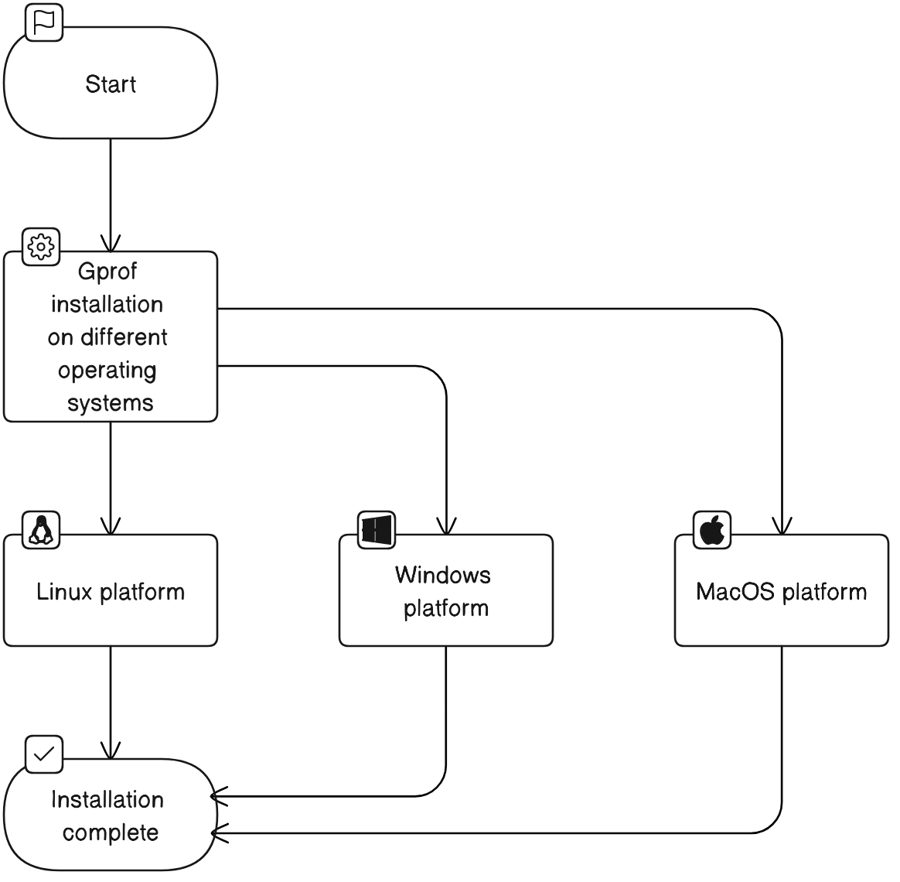

#  Gprof工具  
## 第一章：引言
### 1.1 Gprof工具的概述
Gprof是一个强大的性能分析工具，它可以帮助我们理解C/C++程序的运行情况。通过使用Gprof，我们可以获取到程序中各个函数的调用信息，包括调用次数、执行时间等，这对于我们优化程序、提高程序运行效率具有重要的意义。

Gprof（GNU Profiler，GNU性能分析器）是GNU编译器套件（GCC）的一部分，它可以对程序进行性能分析，找出程序中的瓶颈，帮助我们优化代码。Gprof的工作原理是采样程序的PC（程序计数器）值，通过PC值可以找到程序运行时CPU花费时间最多的部分。

### 1.2 Gprof的重要性和应用场景
在软件开发中，性能优化是一个重要的环节。尤其是在嵌入式系统开发中，由于硬件资源有限，性能优化显得尤为重要。Gprof作为一个性能分析工具，可以帮助我们找出程序中的性能瓶颈，从而进行针对性的优化。

Gprof的应用场景主要包括：  

- 性能瓶颈分析：通过Gprof，我们可以找出程序中执行时间最长的函数，这些函数往往是性能瓶颈所在。  
- 函数调用关系分析：Gprof可以提供函数的调用关系，帮助我们理解程序的执行流程。  
- 代码优化：通过Gprof的分析结果，我们可以对代码进行优化，提高程序的运行效率。  
下面是一个使用Gprof进行性能分析的简单示例：

```C
#include <iostream>
#include <vector>

void func() {
    std::vector<int> v;
    for (int i = 0; i < 10000000; ++i) {
        v.push_back(i);
    }
}

int main() {
    func();
    return 0;
}

```  
我们可以通过以下命令进行编译和运行：
```C
g++ -pg -o test test.cpp
./test
gprof test gmon.out > analysis.txt

```  
在生成的analysis.txt文件中，我们可以看到各个函数的执行时间和调用次数等信息，这对于我们理解程序的运行情况和进行性能优化是非常有帮助的。

在后续的章节中，我们将深入探讨Gprof的安装、使用方法、性能指标、报告生成和可视化等内容，帮助读者更好地理解和使用这个强大的工具。


## 第二章：Gprof的安装
在本章中，我们将详细介绍如何在不同的操作系统平台上安装Gprof。我们将覆盖Linux，Windows和MacOS三大主流操作系统。

### 2.1 在Linux平台上安装Gprof
在Linux平台上，Gprof通常作为GCC（GNU编译器集合，GNU Compiler Collection）的一部分提供。因此，安装GCC就可以得到Gprof。在大多数Linux发行版中，GCC都已经预装了，如果没有，可以通过包管理器进行安装。例如，在基于Debian的系统中，可以使用以下命令安装：
```commandline
sudo apt-get install gcc
```
在安装完成后，可以通过以下命令检查Gprof是否已经可用：
```commandline
gprof --version
```
如果Gprof已经正确安装，这个命令将输出Gprof的版本信息。

### 2.2 在Windows平台上安装Gprof
在Windows平台上，我们可以通过MinGW（Minimalist GNU for Windows）来安装Gprof。MinGW是一个将GCC编译器和GNU Binutils移植到Windows的项目，包括Gprof。首先，我们需要从MinGW的官方网站下载并安装MinGW。

在安装MinGW后，我们需要打开MinGW Installation Manager，然后在"Basic Setup"选项卡中选择"mingw32-base"和"mingw32-gcc-g++"进行安装。在"All Packages"选项卡中，选择"mingw32-gprof"进行安装。

安装完成后，需要将MinGW的bin目录添加到系统的PATH环境变量中。这样，我们就可以在命令行中直接运行gprof命令了。
### 2.3 在MacOS平台上安装Gprof
在MacOS平台上，我们可以通过Homebrew来安装Gprof。Homebrew是一个MacOS平台的包管理器，可以方便地安装各种软件。首先，我们需要在MacOS上安装Homebrew。安装完成后，可以通过以下命令安装Gprof：
```commandline
brew install gcc
```

这个命令将安装GCC，包括Gprof。安装完成后，可以通过以下命令检查Gprof是否已经可用：
```commandline
gprof --version
```
如果Gprof已经正确安装，这个命令将输出Gprof的版本信息。

下图是Gprof在不同操作系统上的安装流程的概览：

## 第三章：Gprof的使用
### 3.1 Gprof的基本命令
在使用Gprof进行性能分析之前，我们需要了解一些基本的命令。以下是一些常用的Gprof命令：

命令	中文解释	英文解释
gprof [options] [executable-file [profile-data-files…]] [> outputfile]	Gprof命令行格式	Gprof command line format  
  -b	简洁输出，不显示冗长的解释	Brief output. Do not display verbose explanations  
  -s	将多个gmon.out文件合并	Summarize: merge several profile data files for cumulative stats  
  -p	显示程序的每个函数的执行时间统计	Display program’s functions execution time statistics  
  -q	显示程序的每个函数的调用关系	Display program’s functions call graph  

### 3.2 如何使用Gprof进行性能分析
在使用Gprof进行性能分析时，我们需要遵循以下步骤：

编译程序：在编译程序时，我们需要使用-pg选项来启用Gprof性能分析。例如，如果我们的源代码文件名为main.cpp，我们可以使用以下命令进行编译：
```commandline
g++ -pg -o main main.cpp
```
运行程序：运行程序将生成一个名为gmon.out的性能分析数据文件。我们可以使用以下命令运行程序：
```
./main
```
生成性能报告：使用Gprof命令和性能分析数据文件生成性能报告。我们可以使用以下命令生成性能报告：
```commandline
gprof main gmon.out > analysis.txt
```
这将生成一个名为analysis.txt的文本文件，其中包含性能分析报告。
### 3.3 Gprof的高级使用技巧
#### 3.3.1 使用-s选项合并多个性能分析数据文件
如果我们有多个gmon.out文件（例如，我们的程序被多次执行，并且每次执行都生成了一个gmon.out文件），我们可以使用-s选项将这些文件合并成一个文件，然后使用Gprof生成一个累积的性能分析报告。例如：
```commandline
gprof -s main gmon.out gmon.out.1 gmon.out.2
gprof main gmon.sum > analysis.txt
```
### 3.3.2 使用-b和-p选项生成简洁的性能报告
如果我们只对程序的每个函数的执行时间统计感兴趣，并且不需要冗长的解释，我们可以使用-b和-p选项生成一个简洁的性能报告。例如：
``commandline
gprof -b -p main gmon.out > analysis.txt
``
这将生成一个只包含程序的每个函数的执行时间统计的性能报告。
### 3.4 关于检测动态库文件
如果你想要使用gprof来分析动态库（也称为共享库或.so文件）的性能，那么你需要确保动态库是以-pg选项进行编译和链接的。这是因为-pg选项会让编译器在每个函数的入口和出口处插入用于收集性能数据的代码。

然而，仅仅对动态库使用-pg选项并不足以进行性能分析。你还需要确保主程序（即调用动态库的可执行文件）也是以-pg选项进行编译和链接的。这是因为gprof需要主程序在退出时将收集到的性能数据写入名为gmon.out的文件中。如果主程序没有使用-pg选项，那么它将不会生成gmon.out文件，从而导致gprof无法进行性能分析。

所以，如果你想要使用gprof来分析动态库的性能，你需要确保主程序和动态库都是以-pg选项进行编译和链接的。

### 3.5 没有加-pg后检测的提示信息
如果你尝试运行gprof在一个没有使用-pg选项编译的程序上，gprof将无法找到性能分析数据，因为没有gmon.out文件生成。在这种情况下，gprof通常会显示如下的错误信息：
```commandline
gmon.out: No such file or directory
```
这个错误信息表示gprof无法找到gmon.out文件，因此无法进行性能分析。这是因为只有使用-pg选项编译的程序在运行结束后才会生成gmon.out文件。

所以，如果你想要使用gprof进行性能分析，你需要确保你的程序是使用-pg选项进行编译的。

### 3.6 检测是否包含gprof工具编译
gprof 工具是通过在程序中插入性能分析代码来收集性能数据的，而这些性能分析代码是由编译器自动生成的，而不是由程序员手动添加的。

具体来说，当您在编译程序时加上 -pg 参数时，编译器会在程序中插入性能分析代码，以便在程序运行时收集性能数据。这些性能分析代码包括 mcount 函数和 __gnu_profile_* 函数等，它们会在程序的函数调用和返回时进行计数，并将计数结果写入到 gmon.out 文件中。

在程序运行结束后，您可以使用 gprof 工具来分析 gmon.out 文件，以便了解程序的性能瓶颈和优化方向。因此，使用 gprof 工具并不需要在程序中手动添加性能分析代码，只需要在编译时加上 -pg 参数即可。

可以使用 objdump 命令来查看可执行文件的符号表信息，以验证是否已经加上了 -pg 参数。具体来说，您可以使用以下命令来查看可执行文件的符号表信息：
```commandline
objdump -t <executable-file>
```
如果 -pg 参数已经加上了，那么您应该能够在符号表中看到以 mcount 开头的符号。这些符号是 gprof 工具插入的性能分析代码。如果您没有看到这些符号，那么可能是 -pg 参数没有正确加上，或者您的程序中没有执行到插入的性能分析代码。
类似这样的行
```commandline
0000000000000000 F *UND* 0000000000000000 mcount@GLIBC_2.2.5
```
### 3.7 无法生成gmon.out文件的原因
如果你的程序没有生成 gmon.out 文件，可能有以下几个原因：

- 编译时没有加 -pg 参数：如果你在编译和链接你的程序时没有加 -pg 参数，那么程序就不会生成 gmon.out 文件。你需要确保你在编译和链接你的程序时都加上了 -pg 参数。  

- 程序没有正常退出：gmon.out 文件是在程序正常退出时生成的。如果你的程序崩溃了，或者被强制终止了，那么可能就不会生成 gmon.out 文件。你需要确保你的程序能够正常退出。  

- 程序运行在不支持 gprof 的环境中：某些环境可能不支持 gprof，例如某些嵌入式系统或者容器环境。在这些环境中运行程序可能就不会生成 gmon.out 文件。  

- 程序没有足够的权限写入 gmon.out 文件：如果你的程序没有足够的权限在当前目录下创建文件，那么就无法生成 gmon.out 文件。你需要确保你的程序有足够的权限在当前目录下创建文件。  

- 程序运行时间太短：如果程序运行时间非常短，可能来不及生成 gmon.out 文件。你可以尝试让程序运行时间长一些，看是否能生成 gmon.out 文件。  

- 检测多线程的程序：如果你在多线程程序中使用gprof，可能会遇到无法生成gmon.out文件的问题。gprof并不支持多线程程序的性能分析，因此在多线程环境下使用gprof可能会导致性能数据的不准确，甚至无法生成性能数据文件。  

如果你检查了以上所有可能的原因，但还是无法生成 gmon.out 文件，那么可能需要更深入地调查问题。你可以尝试在不同的环境中运行你的程序，或者使用其他的性能分析工具，看是否能找到问题的原因。

## 第四章：理解Gprof的性能指标
在使用Gprof进行性能分析时，我们会遇到一些特定的性能指标。这些指标可以帮助我们更好地理解程序的运行情况，从而找出性能瓶颈并进行优化。下面我们将详细介绍这些性能指标。

### 性能指标概述
在Gprof的报告中，主要的性能指标包括：
- 总体运行时间（Total running time）  
- 自身运行时间（Self running time） 
- 子程序运行时间（Subroutine running time）  
- 调用次数（Call counts）  
- 平均运行时间（Average running time）  
下面我们将逐一进行详细介绍。

- 总体运行时间（Total running time）  
总体运行时间是指程序从开始运行到结束的总时间。这个指标可以帮助我们了解程序的整体性能情况。

- 自身运行时间（Self running time）  
自身运行时间是指函数自身的运行时间，不包括调用其他函数所花费的时间。这个指标可以帮助我们找出程序中耗时的部分。

- 子程序运行时间（Subroutine running time）  
子程序运行时间是指函数调用其他函数所花费的时间。这个指标可以帮助我们了解函数的调用关系和性能影响。

- 调用次数（Call counts）  
调用次数是指函数被调用的次数。这个指标可以帮助我们了解函数的使用频率。

- 平均运行时间（Average running time）  
平均运行时间是指函数每次被调用时的平均运行时间。这个指标可以帮助我们了解函数的性能情况。

下面是一个Gprof报告的示例，我们可以看到上述性能指标在报告中的具体表现：
```text
Flat profile:

Each sample counts as 0.01 seconds.
  %   cumulative   self              self     total           
 time   seconds   seconds    calls  ms/call  ms/call  name    
 50.00      0.01     0.01                             main
 50.00      0.02     0.01        2     5.00     5.00  func1
  0.00      0.02     0.00        1     0.00     0.00  func2

```

在这个报告中，main函数的自身运行时间是0.01秒，调用次数是2次，平均运行时间是5毫秒/次。func1函数的自身运行时间也是0.01秒，调用次数是1次，平均运行时间是0毫秒/次。func2函数的自身运行时间是0秒，调用次数是1次，平均运行时间是0毫秒/次。

通过这些性能指标，我们可以了解到main函数和func1函数是程序中的性能瓶颈，需要进行优化。

## 第五章：Gprof的性能检测深度和颗粒度
在使用Gprof进行性能分析时，我们需要理解两个重要的概念：性能检测深度（Profiling Depth）和性能检测颗粒度（Profiling Granularity）。这两个概念对于我们理解Gprof的性能分析结果，以及如何根据这些结果进行性能优化，都有着重要的作用。

### 5.1 Gprof的性能检测深度
性能检测深度是指Gprof能够追踪到的函数调用的深度。例如，如果我们的程序从main函数开始，main函数调用了函数A，函数A又调用了函数B，那么这就形成了一个函数调用链。Gprof可以追踪到这个调用链的深度，从而帮助我们理解程序的执行流程，以及各个函数在执行过程中消耗的时间。

```C
int main() {
    functionA();  // main函数调用函数A
}

void functionA() {
    functionB();  // 函数A调用函数B
}

void functionB() {
    // 函数B的实现
}

```
在这个例子中，Gprof可以追踪到从main函数到函数B的调用链，这就是Gprof的性能检测深度。

### 5.2 Gprof的性能检测颗粒度
性能检测颗粒度是指Gprof能够检测到的最小的代码执行单位。在Gprof中，性能检测的颗粒度通常是函数级别，也就是说，Gprof可以告诉我们每个函数在程序执行过程中消耗的时间，但是它无法告诉我们函数内部的某一行代码或者某一段代码消耗的时间。

```commandline
void function() {
    // 代码段1
    // 代码段2
    // 代码段3
}

```
在这个例子中，Gprof可以告诉我们function函数总体消耗的时间，但是它无法分别告诉我们代码段1、代码段2和代码段3各自消耗的时间，这就是Gprof的性能检测颗粒度。

### 5.3 深度和颗粒度对性能分析的影响
性能检测的深度和颗粒度对于我们理解和优化程序的性能有着重要的影响。深度可以帮助我们理解程序的执行流程，找出性能瓶颈可能存在的函数调用链；而颗粒度则可以帮助我们定位到具体的函数，从而进行更精细化的性能优化。

然而，我们也需要注意，性能检测的深度和颗粒度并不是越大越好。过大的深度可能会使得性能分析结果变得复杂，难以理解；而过小的颗粒度则可能会使得性能分析的开销变大，甚至影响到程序的正常运行。因此，我们需要根据实际的需求和情况，选择合适的性能检测深度和颗粒度。

在下一章节中，我们将介绍如何生成Gprof的性能分析报告，以及如何理解和利用这些报告进行性能优化。
## 第六章：生成和理解Gprof报告
在本章中，我们将深入探讨如何生成Gprof报告，以及如何理解和利用这些报告来优化我们的代码。

### 6.1 如何生成Gprof报告
Gprof报告的生成主要分为三个步骤：编译、运行和解析。

#### 6.1.1 编译
在编译源代码时，我们需要加入-pg选项。这将使得编译器在每个函数的入口和出口处插入额外的代码，用于记录函数的调用信息。例如，如果我们的源代码文件名为main.cpp，则编译命令如下：
```commandline
g++ -pg -o main main.cpp
```
#### 6.1.2 运行
在运行程序时，这些额外的代码将记录函数的调用信息，并将这些信息保存在一个名为gmon.out的文件中。我们只需要正常运行我们的程序即可，例如：
```commandline
./main
```
#### 6.1.3 解析
最后，我们使用Gprof工具解析gmon.out文件，生成我们的性能报告。例如：
```commandline
gprof main gmon.out > report.txt
```

这将生成一个名为report.txt的文本文件，其中包含了我们的性能报告。

### 6.2 Gprof报告的结构和内容
Gprof报告主要包含两部分内容：平坦剖面（Flat Profile）和调用图（Call Graph）。

#### 6.2.1 平坦剖面（Flat Profile）
平坦剖面列出了每个函数的以下信息：

- 函数名（Name）  
- 总调用次数（Total Calls）  
- 总执行时间（Total Time）  
- 平均执行时间（Average Time）  
#### 6.2.2 调用图（Call Graph）
调用图则提供了更详细的信息，包括每个函数的调用者和被调用者，以及相应的调用次数和执行时间。

### 6.3 如何理解和利用Gprof报告
理解Gprof报告的关键在于理解其性能指标。例如，如果一个函数的总执行时间很长，那么我们可能需要优化这个函数以提高程序的性能。如果一个函数被频繁地调用，那么我们可能需要检查是否可以减少其调用次数。

利用Gprof报告进行性能优化的一般步骤如下：
- 首先，查看平坦剖面，找出总执行时间最长的函数。  
- 然后，查看这些函数在调用图中的位置，找出它们的调用者和被调用者。  
- 最后，根据这些信息，确定优化策略。例如，我们可以尝试优化执行时间最长的函数，或者减少某个被频繁调用的函数的调用次数。  
在下一章中，我们将介绍如何将Gprof报告进行可视化，以更直观地理解和利用这些信息。

## 第七章：Gprof报告的可视化
###7.1 Gprof报告可视化的重要性
Gprof报告虽然包含了丰富的性能分析数据，但是其文本形式的输出可能对于初学者来说难以理解和分析。通过可视化工具，我们可以将这些数据转化为图形，使得性能瓶颈和优化方向更加直观明了。这对于我们理解程序的运行情况，找出性能瓶颈，优化程序有着重要的作用。

### 7.2 Gprof报告的可视化工具
Gprof报告可以通过多种工具进行可视化，其中最常用的是gprof2dot和KCacheGrind。

- gprof2dot：这是一个Python脚本，可以将Gprof的输出转化为dot格式，然后通过Graphviz工具进行可视化。  
- KCacheGrind：这是一个更强大的可视化工具，它不仅支持Gprof，还支持其他多种性能分析工具的输出，如Valgrind的Callgrind工具。  
### 7.3 如何进行Gprof报告的可视化
#### 7.3.1 使用gprof2dot进行可视化
首先，我们需要安装gprof2dot和Graphviz。在Ubuntu系统中，可以通过以下命令进行安装：
```commandline
sudo apt-get install python3-gprof2dot graphviz
```

然后，我们可以通过以下命令将Gprof的输出转化为dot格式，并使用Graphviz进行可视化：
```commandline
gprof your_program | gprof2dot | dot -Tpng -o output.png
```
在这里，your_program是你的程序名，output.png是生成的可视化结果。

#### 7.3.2 使用KCacheGrind进行可视化
首先，我们需要安装KCacheGrind和Valgrind。在Ubuntu系统中，可以通过以下命令进行安装：
```commandline
sudo apt-get install kcachegrind valgrind
```
然后，我们可以通过以下命令生成Callgrind的性能分析文件：
```commandline
valgrind --tool=callgrind your_program
```
在这里，your_program是你的程序名。这个命令会生成一个名为callgrind.out.*的文件，其中*是你的程序的进程ID。

最后，我们可以通过以下命令打开KCacheGrind并加载性能分析文件：
```commandline
kcachegrind callgrind.out.*
```
在KCacheGrind中，你可以看到各种详细的性能分析数据，包括函数调用图、调用次数、消耗的CPU时间等，这些都是非常有用的信息，可以帮助我们更好地理解程序的运行情况，找出性能瓶颈，进行优化。

通过以上的步骤，我们可以将Gprof的报告进行可视化，使得性能分析的结果更加直观明了。

## 第八章：Gprof的实战应用
在本章中，我们将深入探讨Gprof在实际项目中的应用。我们将通过一个综合的代码示例来展示如何使用Gprof进行性能分析和优化。我们还将探讨Gprof在大型项目和不同类型项目中的应用差异。

### 8.1 Gprof在实际项目中的应用案例
让我们通过一个具体的例子来看看如何在实际项目中使用Gprof。假设我们正在开发一个嵌入式系统的应用程序，该程序包含多个复杂的算法和数据处理任务。

首先，我们需要在编译时启用Gprof。在GCC编译器中，我们可以通过添加-pg选项来实现这一点。例如：
```commandline
g++ -pg -o my_program my_program.cpp
```
运行程序后，Gprof将生成一个名为gmon.out的性能数据文件。然后，我们可以使用Gprof工具来分析这个文件：
```commandline
gprof my_program gmon.out > analysis.txt
```
这将生成一个名为analysis.txt的文本文件，其中包含了Gprof的分析结果。

在这个文件中，我们可以看到每个函数的调用次数、执行时间、平均执行时间等信息。这些信息可以帮助我们找出程序中的性能瓶颈。

### 8.2 Gprof在大型项目中的性能优化实践
在大型项目中，性能优化通常是一个复杂的过程，需要对代码的执行效率有深入的理解。Gprof提供了一种有效的方式来分析代码的性能。

例如，我们可能会发现某个函数的执行时间特别长。通过查看Gprof的分析结果，我们可以看到这个函数的调用栈（Call Stack），以及每个调用者的执行时间。这可以帮助我们找出性能问题的根源。

在某些情况下，我们可能会发现性能问题是由于某个函数被频繁调用导致的。在这种情况下，我们可以考虑优化这个函数，或者减少对这个函数的调用。

### 8.3 Gprof在不同类型项目中的应用差异
Gprof在不同类型的项目中的应用可能会有所不同。例如，在嵌入式系统项目中，我们可能更关注CPU的使用情况，而在大型的服务器应用中，我们可能更关注内存的使用情况。

下表总结了Gprof在不同类型项目中的应用差异：

|项目类型|关注点|Gprof的应用|  
|----|----|----|
|嵌入式系统|CPU使用情况，实时性|分析函数的执行时间，找出CPU使用高的函数|  
|服务器应用|内存使用情况，响应时间|分析内存分配，找出内存使用高的函数|  
|图形应用|渲染时间，帧率|分析渲染函数的执行时间，优化渲染性能 |
通过理解Gprof在不同类型项目中的应用差异，我们可以更有效地使用Gprof进行性能分析和优化。  

## 第九章：Gprof的局限性和替代工具
在本章中，我们将深入探讨Gprof的局限性，并介绍一些可作为替代的性能分析工具。我们将通过实例代码和详细注释来解释这些知识点。

### 9.1 Gprof的局限性
Gprof是一个强大的性能分析工具，但它并不是万能的。在某些情况下，Gprof可能无法提供我们需要的信息，或者其结果可能不够精确。以下是Gprof的一些主要局限性：

- 多线程程序的性能分析（Performance Analysis of Multithreaded Programs）：Gprof并不适合用于多线程程序的性能分析。这是因为Gprof无法准确地追踪多线程程序中的函数调用关系和时间消耗。  

- 内核级别的性能分析（Kernel-level Performance Analysis）：Gprof主要用于用户级别的程序性能分析，对于内核级别的性能分析，Gprof可能无法提供足够的信息。  

- 实时性能分析（Real-time Performance Analysis）：Gprof通常在程序运行结束后生成性能报告，对于需要实时性能分析的场景，Gprof可能无法满足需求。  

### 9.2 Gprof的替代工具介绍
虽然Gprof有其局限性，但还有许多其他的性能分析工具可以作为替代。以下是一些常见的Gprof替代工具：

|工具名称|适用场景| 优点|缺点|
|----|----|---|----|
|Valgrind|内存泄漏检测，性能分析| 功能强大，支持多种性能分析任务 |运行速度慢|
|gperftools|CPU和堆栈性能分析| 高效，适用于生产环境 | 使用复杂度高|
|OProfile|系统级性能分析|可以分析内核和硬件性能|需要管理员权限|
### 9.3 如何根据项目需求选择合适的性能分析工具
选择性能分析工具时，我们需要考虑以下几个因素：

- 项目的性质和规模（The Nature and Scale of the Project）：不同的项目可能需要不同的性能分析工具。例如，对于大型的、需要深度性能分析的项目，可能需要使用功能强大、支持多种性能分析任务的工具，如Valgrind。  

- 性能分析的需求（The Needs of Performance Analysis）：根据性能分析的需求选择合适的工具。例如，如果需要进行实时性能分析，可能需要选择支持实时性能分析的工具。  

- 团队的技术背景（The Technical Background of the Team）：选择的工具需要与团队的技术背景匹配。例如，如果团队熟悉Python，那么选择支持Python的性能分析工具可能更为合适。  

在选择性能分析工具时，我们需要根据项目的具体情况和需求进行选择，而不是一味地追求新的、复杂的工具。最重要的是找到最适合我们项目的工具，以帮助我们更有效地进行性能分析和优化。
